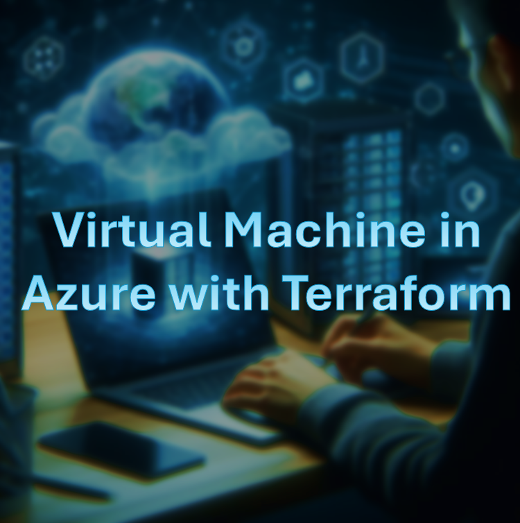
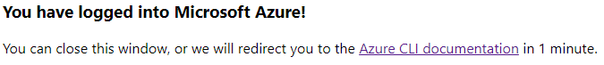
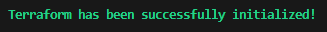
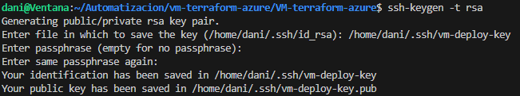
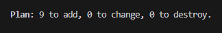
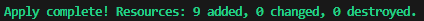
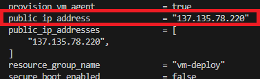
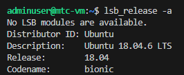
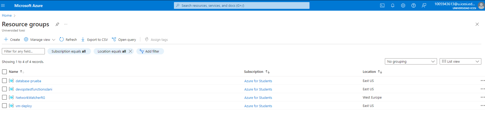
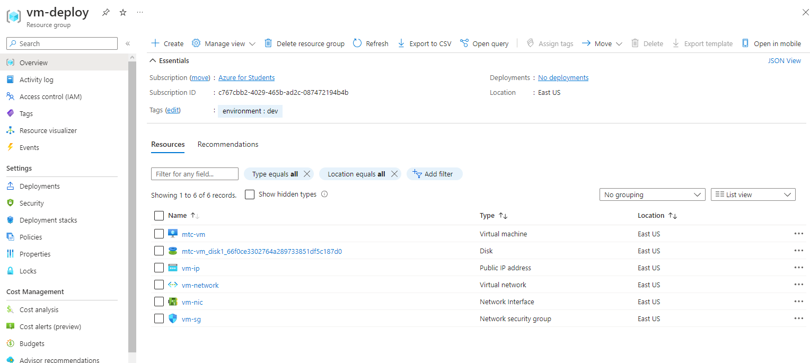

<p align="center">
  
</p>

El proyecto se centra en la creación de una máquina virtual Linux desplegada en Azure y configurada mediante Terraform. Se detallan los requisitos necesarios para llevar a cabo el proyecto, que incluyen Visual Studio Code, Terraform instalado en la máquina local y una cuenta en Azure.

Se describen los pasos para la configuración del proyecto, que involucran el inicio de sesión en Azure desde la consola, la ejecución del comando terraform init para iniciar el proyecto de Terraform y la creación de clases principales como variables.tf, terraform.tfvars, providers.tf y main.tf.

Finalmente, se detallan los pasos para el despliegue en la plataforma Azure, que incluyen la ejecución de los comandos terraform fmt, terraform plan y terraform apply -auto-approve, así como la verificación de los recursos creados en Azure y el acceso a la máquina virtual mediante SSH.

## Requisitos 🎯

Para este proyecto necesitaras

- Visual Studio Code
- Terraform instalado en tu maquina
- Cuenta de azure

Nota: Ten en cuenta que algunos archivos no se encuentran debido al .gitignore, algunos de estos son por ejemplo el terraform.tfvars, terraform.tfstate, etc, algunos de estos se generan automaticamente mientras que otros manualmente, los que se realizaron manualmente se encuentran en la documentacion de este proyecto

## Configuracion del proyecto 📖

Primero, debemos tener una cuenta en azure y logearnos desde la consola, para ello realizamos el siguiente comando

    az login

Este comando nos entregara un link con el cual nos podremos logear y nos deberia aparecer un mensaje como el siguiente en caso de que sea exitosa la operacion

<p align="center">
  
</p

Ahora, debemos ejecutar el comando para iniciar el proyecto de terraform

    terraform init

Nos debera aparecer el siguiente mensaje

<p align="center">
  
</p

## Pasos a seguir para la configuracion del despliegue

Primero, crearemos las clases que se van a necesitar para este proyecto, dichas clases seran

- main.tf
- providers.tf
- terraform.tfvars
- variables.tf

Procederemos primero con las clases con la sintaxis mas sencilla para el proyecto

### variables.tf

En variables.tf, se definen las variables necesarias para el proyecto, como el prefijo para los nombres de los recursos, el nombre de la función y la ubicación de los recursos en Azure.

En esta clase se definiran los nombres de las variables, su tipo y la descripcion, el codigo usado es el siguiente:

```
variable "prefix" {
  type        = string
  description = "Prefix for resource names"
}

variable "name_function" {
  type        = string
  description = "Name of the function"
}

variable "location" {
  type        = string
  description = "Location for the Azure resources"
}
```

## terraform.tfvars

En terraform.tfvars, se asignan valores a estas variables, personalizables según las necesidades del usuario.

```
name_function = "vm-deploy"
location = "East US"
prefix = "vm"
```

## providers.tf

En providers.tf, se especifica el proveedor de la aplicación, en este caso, Azure.

```
provider "azurerm" {
  features {}
}
```

## main.tf

En main.tf, se detallan las principales configuraciones del despliegue, como la creación del grupo de recursos, la red virtual, la subred, el grupo de seguridad de red, las reglas de seguridad, la asignación de grupo de seguridad a la subred, la creación de una IP pública dinámica, la interfaz de red y finalmente la máquina virtual Linux.

Ahora, procedemos a la clase principal del despliegue, primero, se especificara la version de azure

```
# We strongly recommend using the required_providers block to set the
# Azure Provider source and version being used
terraform {
  required_providers {
    azurerm = {
      source  = "hashicorp/azurerm"
      version = "=3.0.0"
    }
  }
}
```

Ahora, se procedera a especificar el grupo de recursos y su nombre, aqui se usaran las variables especificadas anteriormente

```
resource "azurerm_resource_group" "vm-deploy-rg" {
  name     = var.name_function
  location = var.location
  tags = {
    environment = "dev"
  }
}
```

Se procedera ahora a crear la red virtual con el siguiente codigo en el cual tambien se acompañara del uso de la variable prefix

```
resource "azurerm_virtual_network" "vm-deploy-vn" {
  name                = "${var.prefix}-network"
  location            = azurerm_resource_group.vm-deploy-rg.location
  resource_group_name = azurerm_resource_group.vm-deploy-rg.name
  address_space       = ["10.123.0.0/16"]
  tags = {
    environment = "dev"
  }
}
```

Ahora, se creara la subnet de la red

```
resource "azurerm_subnet" "vm-deploy-subnet" {
  name                 = "${var.prefix}-subnet"
  resource_group_name  = azurerm_resource_group.vm-deploy-rg.name
  virtual_network_name = azurerm_virtual_network.vm-deploy-vn.name
  address_prefixes     = ["10.123.1.0/24"]
}
```

Aqui se especifica una subred con mascara 24 y que parte de la direccion 10.123.1.4 ya que los primeros bits de red seran usados por otras nics que necesita azure para su funcionamiento

Ahora, se procede a crear el grupo de seguridad que estara presente en la red creada

```
resource "azurerm_network_security_group" "vm-deploy-sg" {
  name                = "${var.prefix}-sg"
  location            = azurerm_resource_group.vm-deploy-rg.location
  resource_group_name = azurerm_resource_group.vm-deploy-rg.name

  tags = {
    environment = "dev"
  }
}
```

Se procede ahora a crear una regla de seguridad que nos permitira especificar que tipo de trafico queremos permitir en nuestra red, en este caso, queremos controlar el trafico entrante, es decir, inbound, y a su vez, aqui tambien especificamos la union de este recurso con el grupo de seguridad

```
resource "azurerm_network_security_rule" "mtc-dev-rule" {
    name = "mtc-dev-rule"
    priority = 100
    direction = "Inbound"
    access = "Allow"
    protocol = "_"
    source_port_range = "_"
    destination_port_range = "_"
    source_address_prefix = "_"
    destination_address_prefix = "\*"
    resource_group_name = azurerm_resource_group.mtc-rg.name
    network_security_group_name = azurerm_network_security_group.mtc-sg.name
}
```

Ahora, ya que tenemos la regla linkeada al grupo de seguridad, nos falta entonces linkear dicho grupo de seguridad a la subred, esto se realiza con el siguiente codigo

```
resource "azurerm_subnet_network_security_group_association" "vm-deploy-sga" {
  subnet_id                 = azurerm_subnet.vm-deploy-subnet.id
  network_security_group_id = azurerm_network_security_group.vm-deploy-sg.id
}
```

Ahora generamos una ip dinamica publica para luego poder acceder a la maquina virtual de forma remota

```
resource "azurerm_public_ip" "vm-deploy-ip" {
  name                = "${var.prefix}-ip"
  resource_group_name = azurerm_resource_group.vm-deploy-rg.name
  location            = azurerm_resource_group.vm-deploy-rg.location
  allocation_method   = "Dynamic"

  tags = {
    environment = "dev"
  }
}
```

Ahora procedemos a crear la nic para la maquina virtual la cual tendra una ip privada y una ip publica

```
resource "azurerm_network_interface" "vm-deploy-nic" {
  name                = "${var.prefix}-nic"
  location            = azurerm_resource_group.vm-deploy-rg.location
  resource_group_name = azurerm_resource_group.vm-deploy-rg.name

  ip_configuration {
    name                          = "internal"
    subnet_id                     = azurerm_subnet.vm-deploy-subnet.id
    private_ip_address_allocation = "Dynamic"
    public_ip_address_id          = azurerm_public_ip.vm-deploy-ip.id
  }

  tags = {
    environment = "dev"
  }
}
```

Generamos ahora una maquina virtual con los siguientes atributos

```
resource "azurerm_linux_virtual_machine" "vm-deploy-vm" {
  name                  = "mtc-vm"
  resource_group_name   = azurerm_resource_group.vm-deploy-rg.name
  location              = azurerm_resource_group.vm-deploy-rg.location
  size                  = "Standard_B1s"
  admin_username        = "adminuser"
  network_interface_ids = [azurerm_network_interface.vm-deploy-nic.id, ]


  os_disk {
    caching              = "ReadWrite"
    storage_account_type = "Standard_LRS"
  }

  source_image_reference {
    publisher = "Canonical"
    offer     = "UbuntuServer"
    sku       = "18.04-LTS"
    version   = "latest"
  }

  tags = {
    environment = "dev"
  }
}
```

Ahora, para la parte del ssh, primero debemos generar una clave interna para luego usarla como modo de seguridad en el ssh, para generar dicha clave, se debe realizar el siguiente comando

    ssh-keygen -t rsa

Aqui debemos sobreescribir el nombre del archivo que guarda la key si asi lo deseamos

<p align="center">
  
</p

Ahora, agregamos en alguna parte del recurso de la creacion de la maquina virtual linux el siguiente codigo

```
admin_ssh_key {
    username   = "adminuser"
    public_key = file("~/.ssh/vm-deploy-key.pub")
}
```

En donde debemos modificar el nombre en file en base al que nosotros escogimos

## Deployment

Lo siguiente sera generar este recurso en la plataforma azure, hacerlo visible en la nube, para ello primero ejecutamos el comando para organizar la sintaxis

    terraform fmt

Luego ejecutamos el comando para revisar los recursos a crear y la sintaxis del codigo

    terraform plan

<p align="center">
  
</p

Por ultimo, desplegamos todo en la nube con

    terraform apply -auto-approve

<p align="center">
  
</p

Ahora, podemos ver la lista de los recursos creados con el comando

    terraform state list

<p align="center">
  
</p

Podemos ahora acceder mediante ssh a la maquina virtual haciendo uso de su direccion ip, para ver primero su dir ip podemos hacer uso del comando

    terraform state show azurerm_linux_virtual_machine.vm-deploy-vm

<p align="center">
  
</p

Ejecutamos el siguiente comando

    ssh -i ~/.ssh/vm-deploy-key adminuser@137.135.78.220

Y tendremos acceso exitoso a la maquina virtual mediante ssh

<p align="center">
  
</p

## Comprobaciones en la paltaforma azure ✏️

Podemos tambien ver los recursos creados en la plataforma azure

<p align="center">
  
</p>

<p align="center">
  
</p>

## Realizado por 😎

- **Daniel Ramirez - A00368788**
  - GitHub: [Danilops](https://github.com/DanielRamirez1901)
